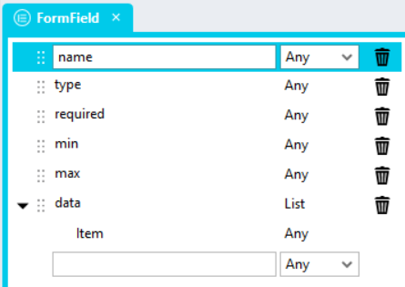
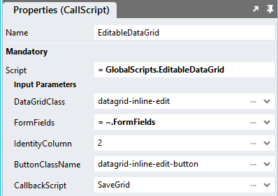
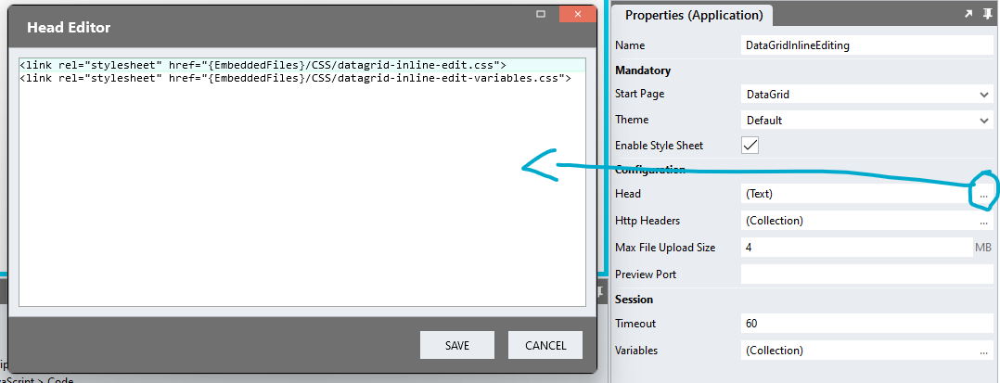

# Datagrid Inline Editing

Allowing users to conveniently and swiftly edit entire DataGrids

https://github.com/stadium-software/datagrid-inline-edit/assets/2085324/ea67ef78-23b1-468e-bd44-31b10d652d72

# Content
- [Datagrid Inline Editing](#datagrid-inline-editing)
- [Content](#content)
  - [Version](#version)
- [Setup](#setup)
  - [Application Setup](#application-setup)
  - [Database, Connector and DataGrid](#database-connector-and-datagrid)
  - [Type Setup](#type-setup)
  - [Global Script Setup](#global-script-setup)
  - [Page-Script Setup](#page-script-setup)
  - [Page Setup](#page-setup)
  - [Page.Load Event Setup](#pageload-event-setup)
  - [Button.Click Event Setup](#buttonclick-event-setup)
  - [Applying the CSS](#applying-the-css)
  - [Customising CSS](#customising-css)
  - [CSS Upgrading](#css-upgrading)

## Version 
2.1 current version

2.0 Added checkbox column support; changed header-based column definition to column count; added text and value definition for dropdowns. **Required changes**
1. FormField Type: change "name" property to "column" (see [Type Setup](#type-setup))
2. Script (see [Global Script Setup](#global-script-setup))
   1. Update script to version below
   2. Change input parameter name "IdentityColumnHeader" to "IdentityColumn"
3. Event handler (see [Button.Click Event Script](#buttonclick-event-setup))
   1. Added support for dropdown text and value definition (see [example below](#buttonclick-event-setup))

2.1 Changes
1. Data changes are reflected in DataGrids
2. Added support for DataGrid search and sort of changed values
3. Returns columns as object properties. Example:
```json
[
    {
        "ID":1,
        "FirstName":"Martina",
        "LastName":"Vaughn",
        "NoOfChildren":10,
        "NoOfPets":9,
        "StartDate":"2023-10-01",
        "EndDate":"2023-10-02",
        "Healthy":true,
        "Happy":false,
        "Subscription":"Subscribed"
    },
    {
        "ID":2,
        "FirstName":"Bruce",
        "LastName":"ddd",
        "NoOfChildren":10,
        "NoOfPets":1,
        "StartDate":"2023-06-19",
        "EndDate":"2024-05-01",
        "Healthy":true,
        "Happy":false,
        "Subscription":"Unsubscribed"
    }
]
```

2.2 Fixed "control in template" bug; enhanced "FormField" data type

# Setup

## Application Setup
1. Check the *Enable Style Sheet* checkbox in the application properties

## Database, Connector and DataGrid
1. Use the instructions from [this repo](https://github.com/stadium-software/samples-database) to setup the database and DataGrid for this sample

## Type Setup
1. Create a *Type* called "FormField"
2. Add the following properties to the type
   1. "column" (Any)
   2. "type" (Any)
   3. "required" (Any)
   4. "min" (Any)
   5. "max" (Any)
   6. "data" (List)
      1. "Item" (Object)
         1. "text" (Any)
         2. "value" (Any)



## Global Script Setup
1. Create a Global Script called "EditableDataGrid"
2. Add four input parameters to the Global Script
   1. ButtonClassName
   2. DataGridClass
   3. FormFields
   4. IdentityColumn
   5. CallbackScript
3. Drag a *JavaScript* action into the script
4. Add the Javascript below into the JavaScript code property
```javascript
/*Stadium Script Version 2.2 https://github.com/stadium-software/datagrid-inline-edit */
let scope = this;
let random =  Math.round(Math.random() * 1000);
let callback = ~.Parameters.Input.CallbackScript;
let classInput = ~.Parameters.Input.DataGridClass;
if (typeof classInput == "undefined") {
    console.error("The DataGridClass parameter is required");
    return false;
} 
let dgClassName = "." + classInput;
let dg = document.querySelectorAll(dgClassName);
if (dg.length == 0) {
    console.error("The class '" + dgClassName + "' is not assigned to any DataGrid");
    return false;
} else if (dg.length > 1) {
    console.error("The class '" + dgClassName + "' is assigned to multiple DataGrids. DataGrids using this script must have unique classnames");
    return false;
} else { 
    dg = dg[0];
}
dg.classList.add("stadium-inline-edit-datagrid");
let datagridname = dg.id.split("_")[1].replace("-container","");
let table = dg.querySelector("table");
let dataGridColumns = getColumnDefinition();
let rowFormFields = ~.Parameters.Input.FormFields;
let IDColumn = ~.Parameters.Input.IdentityColumn;
let buttonParentClass = ~.Parameters.Input.ButtonClassName;
if (!isNumber(IDColumn)) {
    IDColumn = getElementIndex(dataGridColumns, IDColumn) + 1;
}
let idColumnName = dataGridColumns[IDColumn - 1];
let buttons = document.querySelectorAll("." + buttonParentClass);
if (buttons.length == 0) {
    console.error("There seems to be no button assigned to the DataGrid. Add a button to the page, assign a class to the button and add it to the 'ButtonClassName' parameter when you call the script");
    return false;
} else if (buttons.length > 1) {
    console.error("The class '" + buttonParentClass + "' is assigned to multiple buttons on this page. Buttons using this script must have unique classnames");
    return false;
}
let setRowEditingMode = (e) => {
    let currentRow = e.target.closest("tr");
    let editing = document.querySelector(".editing");
    if (editing) {
        editing.classList.remove("editing");
    }
    currentRow.classList.add("editing");
};
let getElement = (haystack, needle, column) => {
    return haystack.find(obj => {return obj[column] == needle;});
};

resetDataGrid();
insertForm();
initForm();

function initForm(){
    let rows = table.querySelectorAll("tbody tr");
    let clonedTable = table.cloneNode(true);
    clonedTable.id = 'table-clone';
    clonedTable.querySelector("tfoot").remove();
    let clonedRows = clonedTable.querySelectorAll("tbody tr");
    for (let j = 0; j < rows.length; j++){
        let origRow = rows[j];
        let editRow = clonedRows[j];
        editRow.id = origRow.id + "-clone";
        let origCells = origRow.querySelectorAll("td");
        let editCells = editRow.querySelectorAll("td");
        let IDVal = origCells[IDColumn - 1].textContent;
        IDVal = convertToNumber(IDVal);
        let rowData = getElementFromObjects(scope[`${datagridname}Data`], IDVal, idColumnName);
        editRow.setAttribute("data-id", IDVal);
        for (let i = 0; i < origCells.length; i++) {
            let colNum = i+1, type, data, min, max, required, el, value;
            let origCell = origCells[i];
            let editCell = editCells[i];
            let ffield = getElement(rowFormFields, colNum, "column");
            let name = dataGridColumns[i];
            if (!ffield) {
                ffield = getElementFromObjects(rowFormFields, name, "column");
            }
            if (ffield) {
                type = ffield.type;
                data = ffield.data;
                min = ffield.min;
                max = ffield.max;
                required = ffield.required;
            }
            if (name != "RowSelector") value = rowData[name];
            if (type == "text") {
                el = document.createElement("input");
                el.value = value;
                el.setAttribute("stadium-form-name", name);
                el.setAttribute("type", type);
                el.classList.add("form-control");
            }
            if (type == "number") {
                el = document.createElement("input");
                el.setAttribute("type", "number");
                if (min) el.setAttribute("min", min);
                if (max) el.setAttribute("max", max);
                el.addEventListener("keydown",function(e) {
                    if (e.key.toLowerCase() === "e") { 
                        e.preventDefault();
                    }
                }, false);
                el.value = value;
                el.setAttribute("stadium-form-name", name);
                el.classList.add("form-control");
            }
            if (type == "date") {
                el = document.createElement("input");
                el.setAttribute("type", "date");
                el.classList.add("form-control");
                if (min) {
                    let dmin = new Date(min);
                    min = dmin.getFullYear() + '-' + ('0' + (dmin.getMonth() + 1)).slice(-2) + '-' + ('0' + dmin.getDate()).slice(-2);
                    el.setAttribute("min", min);
                }
                if (max) {
                    let dmax = new Date(max);
                    max = dmax.getFullYear() + '-' + ('0' + (dmax.getMonth() + 1)).slice(-2) + '-' + ('0' + dmax.getDate()).slice(-2);
                    el.setAttribute("max", max);
                }
                el.setAttribute("stadium-form-name", name);
                if (value) {
                    let d = new Date(value);
                    el.value = d.getFullYear() + '-' + ('0' + (d.getMonth() + 1)).slice(-2) + '-' + ('0' + d.getDate()).slice(-2);
                }
            }
            if (type == "checkbox") {
                el = document.createElement("input");
                el.setAttribute("stadium-form-name", name);
                el.setAttribute("type", "checkbox");
                if (value == "true" || value == "Yes" || value == "1") {
                    el.setAttribute("checked", "");
                }
            }
            if (type == "dropdown") {
                el = document.createElement("select");
                for (let j = 0; j < data.length; j++) {
                    let option = document.createElement("option");
                    if (typeof data[j].text != "undefined" && typeof data[j].value != "undefined") {
                        option.text = data[j].text;
                        option.value = data[j].value;
                    } else if (typeof data[j] == "object") {
                        let ob = Object.entries(data[j]);
                        option.text = ob[0][0];
                        option.value = ob[0][1];
                    } else {
                        option.text = data[j];
                        option.value = data[j];
                    }
                    if (option.text == value) {
                        option.selected = true;
                    }
                        el.appendChild(option);
                }
                el.setAttribute("stadium-form-name", name);
                el.classList.add("form-control");
            }
            if (colNum == IDColumn) {
                editCell.setAttribute("identity", IDVal);
                el = document.createElement("span");
                el.textContent = value;
            }
            if (!type && !origCell.querySelector(":is(button, a, [type='checkbox'])")) {
                let inpt = document.createElement("input");
                inpt.value = value;
                inpt.setAttribute("type", "hidden");
                inpt.setAttribute("stadium-form-name", name);
                el = document.createElement("div");
                el.textContent = value;
                el.appendChild(inpt);
            }
            if (origCell.querySelector(":is(button, a, [type='checkbox'])")) {
                el = document.createElement("span");
            }
            editRow.addEventListener("click", setRowEditingMode);
            el.classList.add("stadium-inline-form-control");
            if (required) el.setAttribute("required", "");
            editCell.innerHTML = "";
            editCell.appendChild(el);
        }
    }
    dg.appendChild(clonedTable);
    preparePage(clonedTable);
}
document.onkeydown = function (evt) {
    evt = evt || window.event;
    var isEscape = false;
    if ("key" in evt) {
        isEscape = (evt.key === "Escape" || evt.key === "Esc");
    } else {
        isEscape = (evt.keyCode === 27);
    }
    if (isEscape) {
        resetDataGrid();
    }
};

/*--------------------------------------------------------------------------------------*/

function preparePage(clonedTbl) { 
    let stadiumButtonClass = "stadium-inline-edit-datagrid-button";
    let editButtonParent = document.querySelector("." + buttonParentClass);
    let editButton;
    if (!editButtonParent) {
        editButtonParent = document.createElement("div");
        editButton = document.createElement("button");
        editButtonParent.classList.add(stadiumButtonClass);
        dg.prepend(editButtonParent);
    } else { 
        editButtonParent.classList.add(stadiumButtonClass);
        editButton = editButtonParent.querySelector("button");
    }

    let buttonBar = document.createElement("div");
    buttonBar.classList.add("edit-button-bar");
    editButton.classList.add("visually-hidden");
    
    let saveButton = document.createElement("button");
    saveButton.setAttribute("class", "btn btn-lg btn-default");
    saveButton.setAttribute("type", "submit");
    saveButton.setAttribute("form", "form" + random);
    saveButton.innerText = "Save";

    let cancelLink = document.createElement("a");
    cancelLink.setAttribute("class", "btn btn-lg btn-link");
    cancelLink.innerText = "Cancel";
    cancelLink.addEventListener("click", resetDataGrid);
    
    buttonBar.appendChild(saveButton);
    buttonBar.appendChild(cancelLink);
    editButtonParent.appendChild(buttonBar);

    let arrHeadings = clonedTbl.querySelectorAll("thead th");
    for (let i = 0; i < arrHeadings.length; i++) {
        arrHeadings[i].childNodes[0].classList.add("visually-hidden");
        let heading = document.createElement("span");
        heading.innerText = arrHeadings[i].innerText;
        heading.classList.add("inline-edit-heading");
        arrHeadings[i].innerHTML = heading.innerHTML;
    }

    clonedTbl.classList.add("edit-table");
    table.classList.add("edit-orig-table");

    let hasStatusBar = dg.querySelector(".selection-status-bar");
    if (hasStatusBar) hasStatusBar.style.display = "none";
}
async function saveButtonClick(e) { 
    e.preventDefault();
    let rows = dg.querySelectorAll("#table-clone tbody tr");
    let arrGridData = [];
    for (let j = 0; j < rows.length; j++) {
        let objData = {}, callbackData = {};
        let IDVal;
        let cells = rows[j].cells;
        for (let i = 0; i < cells.length; i++) {
            let formField = cells[i].querySelector("[stadium-form-name]:not([stadium-form-name='']");
            if (formField) {
                let fieldValue = formField.value;
                fieldValue = convertToNumber(fieldValue);
                if (formField.getAttribute("type") == "checkbox") fieldValue = formField.checked;
                objData[dataGridColumns[i]] = fieldValue;
                if (formField.tagName == "SELECT") fieldValue = formField.options[formField.selectedIndex].text;
                callbackData[dataGridColumns[i]] = fieldValue;
                if (cells[i].getAttribute("Identity")) {
                    IDVal = cells[i].getAttribute("Identity");
                }
            }
        }
        updateDataModelRow(IDVal, callbackData);
        arrGridData.push(objData);
    }
    await scope[callback](arrGridData);
    resetDataGrid();
}
function resetDataGrid() { 
    let form = document.getElementById("form" + random);
    if (form) { 
        let editTable = form.querySelector("#table-clone");
        editTable.remove();
        form.querySelector(".edit-orig-table").classList.remove("edit-orig-table");
        dg.classList.remove("stadium-inline-edit-datagrid");
        let buttonContainer = document.querySelector("." + buttonParentClass);
        if (buttonContainer) {
            buttonContainer.querySelector("button").classList.remove("visually-hidden");
            buttonContainer.classList.remove("stadium-inline-edit-datagrid-button");
            buttonContainer.querySelector(".edit-button-bar").remove();
        }
        form.parentElement.insertBefore(dg, form);
        form.remove();
    }
    let hasStatusBar = dg.querySelector(".selection-status-bar");
    if (hasStatusBar) hasStatusBar.style.display = "block";
}
function insertForm() { 
    let form = document.createElement('form');
    form.id = "form" + random;
    form.classList.add("datagrid-inline-edit-form");
    form.addEventListener("submit", saveButtonClick);
    dg.parentElement.insertBefore(form, dg);
    form.appendChild(dg);
}
function getElementIndex(haystack, needle) {
    return haystack.indexOf(needle);
}
function getElementFromObjects(haystack, needle, column) {
    return haystack.find(obj => {return obj[column] == needle;});
}
function updateDataModelRow(id, rowData){
    let handler1 = {};
    let dgData = scope[`${datagridname}Data`];
    let result = dgData.map(el => el[dataGridColumns[IDColumn-1]] == id ? new Proxy(rowData, handler1) : el);
    scope[`${datagridname}Data`] = result;
}
function getColumnDefinition(){
    let cols = [];
    let colDefs = scope[`${datagridname}ColumnDefinitions`];
    if (table.querySelector("thead th:nth-child(1) input[type=checkbox")) cols.push("RowSelector");
    for (let i = 0; i < colDefs.length; i++) {
        cols.push(colDefs[i].name);
    }
    return cols;
}
function isNumber(str) {
    if (typeof str == "number") return true;
    return !isNaN(str) && !isNaN(parseFloat(str));
}
function convertToNumber(val) {
    if (!isNumber(val)) {
        let no;
        if (typeof val == "string") no = val.replace(/ /g,"");
        if (isNumber(no)) return Number(no);
    } else {
        val = Number(val);
    }
    return val;
}
```

## Page-Script Setup
1. Create a Script inside of the Page with any name you like (e.g. "SaveGrid")
2. Add one input parameter to the Script
   1. GridData
3. Drag a *Notification* action into the script
4. In the *Message* property, select the *GridData* parameter from the *Script Input Parameters* category
5. When changes are saved, the Notification will display the data being passed into the callback script

## Page Setup
1. Drag a *Button* control into the page and enter some text (e.g. Edit DataGrid)
2. Add a class of your choosing to the *Button* *Classes* property to uniquely identify this button (e.g. datagrid-inline-edit-button)
3. Drag a *DataGrid* control to the page ([see above](#database-connector-and-datagrid))
4. Add a class of your choosing to the *DataGrid* *Classes* property (e.g datagrid-inline-edit)
5. Note: If multiple editable DataGrids are shown on one page, each DataGrid and each corresponding edit button must have unique classnames

## Page.Load Event Setup
1. Populate the DataGrid with data ([see above](#database-connector-and-datagrid))

## Button.Click Event Setup
1. Drag a *List* action into the event script and name the List "FormFields"
2. Set the List *Item Type* property to "Types.FormField"
3. Define the editable columns of your datagrid and their form fields
   1. column: The column number (start counting at 1; include all datagrid columns) OR the column property name as it appears in the list of columns and the column "Name" property

   2. type: The type of the column. Supported are
      1. text
      2. date
      3. number
      4. checkbox
      5. dropdown
      6. email
   3. required: A boolean (add "true" if required)
   4. min: A minimum value for number or date columns
   5. max: A maximum value for number or date columns
   6. data: A simple list of values for dropdowns (see example below)
```json
[{
 "column": "FirstName",
 "type": "text"
},{
 "column": "LastName",
 "type": "text"
},{
 "column": 4,
 "type": "number",
 "min": "0",
 "max": "10",
 "required": "true"
},{
 "column": 5,
 "type": "number",
 "min": "0",
 "max": "10",
 "required": "true"
},{
 "column": 6,
 "type": "date",
 "min": "01-01-2010",
 "max": "01-01-2024"
},{
 "column": 7,
 "type": "date",
 "required": "true"
},{
 "column": 8,
 "type": "checkbox"
},{
 "column": 9,
 "type": "checkbox"
},{
 "column": 10,
 "type": "dropdown",
 "data": [{"text":"","value":""}, {"text":"Subscribed","value":1}, {"text":"Unsubscribed","value":2}, {"text":"No data","value":3}],
 "required": "true"
}]
```
1. Drag the Global Script called "EditableDataGrid" into the event script
2. Complete the Input properties for the script
   1. ButtonClassName: The unique classname you assigned to the *Button* control (e.g. datagrid-inline-edit-button)
   2. DataGridClass: The unique classname you assigned to the *DataGrid* (e.g datagrid-inline-edit)
   3. FormFields: Select the *List* called "FormFields" from the dropdown
   4. IdentityColumn: The column number (e.g. 1) OR the column property name as it appears in the list of columns and the column "Name" property
   5. CallbackScript: The name of the page-level script that will process the updated data (e.g. SaveGrid). 



## Applying the CSS
The CSS below is required for the correct functioning of the module. Some elements can be [customised](#customising-css) using a variables CSS file. 

**Stadium 6.6 or higher**
1. Create a folder called "CSS" inside of your Embedded Files in your application
2. Drag the two CSS files from this repo [*datagrid-inline-edit-variables.css*](datagrid-inline-edit-variables.css) and [*datagrid-inline-edit.css*](datagrid-inline-edit.css) into that folder
3. Paste the link tags below into the *head* property of your application
```html
<link rel="stylesheet" href="{EmbeddedFiles}/CSS/datagrid-inline-edit.css">
<link rel="stylesheet" href="{EmbeddedFiles}/CSS/datagrid-inline-edit-variables.css">
``` 



**Versions lower than 6.6**
1. Copy the CSS from the two css files into the Stylesheet in your application

## Customising CSS
1. Open the CSS file called [*datagrid-inline-edit-variables.css*](datagrid-inline-edit-variables.css) from this repo
2. Adjust the variables in the *:root* element as you see fit
3. Overwrite the file in the CSS folder of your application with the customised file

## CSS Upgrading
To upgrade the CSS in this module, follow the [steps outlined in this repo](https://github.com/stadium-software/samples-upgrading)
